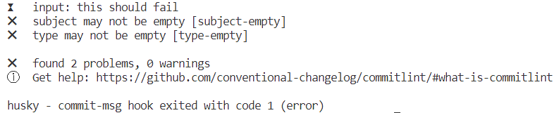
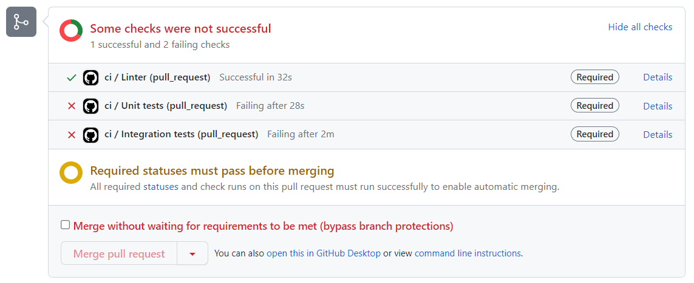
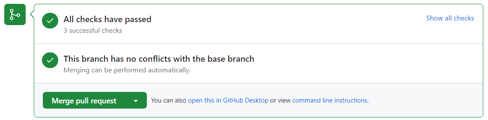

## Инструкция по проверке

Привет. Постучись ко мне в [телеграм](https://t.me/pasha_kryuchkov), чтобы я добавил тебя в соавторы репозитория. Можешь просто форкнуть его, но тогда, как я понимаю, Branch protection rules работать не будут.

После этого склонируй себе репозиторий и выполни команду:

```sh
npm ci
```

Создай новую ветку с именем `branch-[YOUR GITHUB ACCOUNT NAME]`:

```sh
git checkout -b branch-[YOUR GITHUB ACCOUNT NAME]
```

В файле `src/pages/About.tsx` измени заголовок. Это нужно, чтобы поломать тесты:

```
<h1 data-testid="page-title">Not About</h1>
```

Теперь можно проверить как работает commitlint:

```sh
git add .
git commit -m "this should fail"
```

Если всё работает правильно, то должно появиться сообщение об ошибке:



Теперь можно попробовать закоммитить нормально и запушить в репозиторий:

```sh
git commit -m "feat: change about title"
git push --set-upstream origin branch-[YOUR GITHUB ACCOUNT NAME]
```

После этого перейди в github и создай пулл-реквест из ветки `branch-[YOUR GITHUB ACCOUNT NAME]` в ветку `master`. В качестве base repository выбери `pavelkryuchkov/unit-demo-cra`. Github Actions должен запустить линтер и тесты:




Почини заголовок на странице About. После пуша Github Actions должнен перезапустить тесты:


